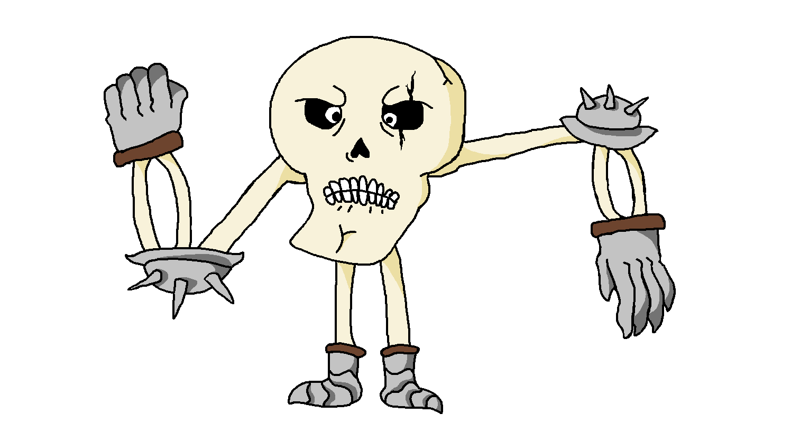

# Text-Based Adventure Game Documentation

This is a basic text adventure game organized in a way to be easy to add new chapters, enemies, weapons and other stuff.
Below there is more info on program structure and a bit of documentation on how to create more stuffs.

## GameState

The GameState class is the heart of the game, handling game dynamics.
It encompasses the entire game world and manipulates its elements.
The class is responsible for:
- Managing player movement.
- Handling enemy positions and movement.
- Controlling the position of objects.
- Drawing the map onto the terminal.
  It is coded as a Singleton, so to get the instance just call `GameState.getInstance()`.

## MapCreation

The MapCreation class is still a work in progress, currently focused on creating an NxN array and checking the accessibility of squares.
Future developments may include more advanced map creation features.

## Player and Other Characters

All characters in the game are derived from the abstract class CharacterEntity.
Key features include:

- **Player:** The Player class is a singleton, ensuring only one instance exists per playthrough.
    - It manages all player stats and weapon and attacks.
    - In future an inventory will be implemented and managed here.
Like the gamestate, it can be called with the `getInstance()` method.
- **Enemies:**
    - Basic monsters are created using methods defined inside BasicMonsters.
    - Unique monsters have specialized classes (e.g., Skeleton) with unique skills or weapons and more complex logic.

## Chapter Package

The `Chapter1` class is the entry point for the actual game chapter:
Every char must have a map, and a game loop.
- To create the map: `gs.setMap(new MapCreator(x, y))`.
- GameLoop is contained inside utils package and its a standard gameLoop that asks for a command and print the position.

## Weapons

Weapons are managed within the `weapon` package, with the potential addition of a `BasicWeapon` class in the future.
Every Unique weapon should have a unique ability, see for example the OffensiveWeapon.
The focus is to mantain ability onto the weapon to ensure that the player is not binded to one combat style during the
playthrough.

## Commands

Command logic is stored inside commands package.
The structure is "command" + "attribute".
Not  all commands have attributes and in future some commands will have more than one.

For now those are the commands:
- **look:** For now has only enemies attribute. Displays names of enemies around.
- **go/move:** Attributes are cardinal points and directions, moves through the map.
- **stop:** No attributes, Closes the program.
- **status:** attributes only player for now. Prints character status.
- **attack:** attribute is enemy name.Does a simple attack on selected enemy.
- **ability:** attributes is enemy name. Initiates the weapon special ability.
- **help:** Work in progress, in future will display helpful hints.
Like the gamestate, it can be called with the `getInstance()` method.

## Moretum and his spectacular enemy artworks:
# B(l)ob
ob.png)
# WeakSkelly

# ThugSkelly

*"Ciao sono una spia" by Rick*
